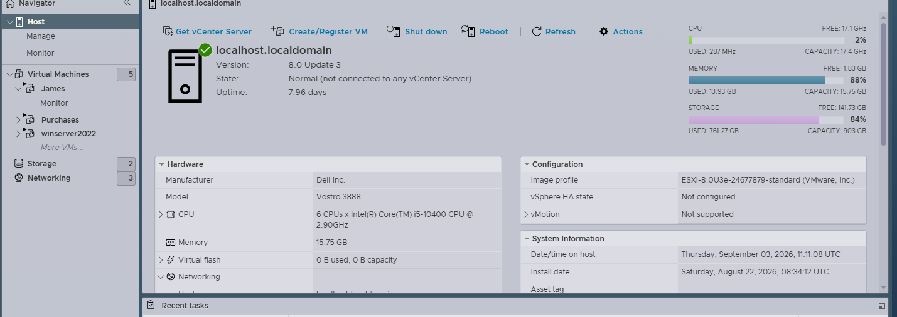
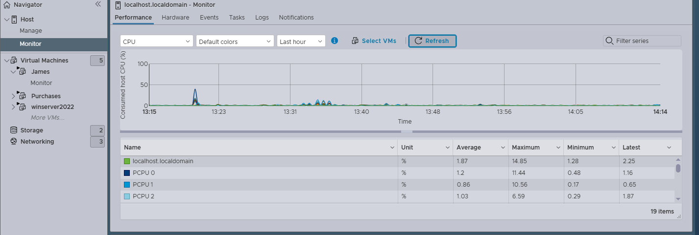
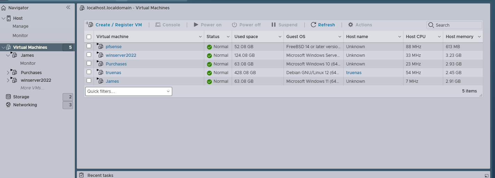
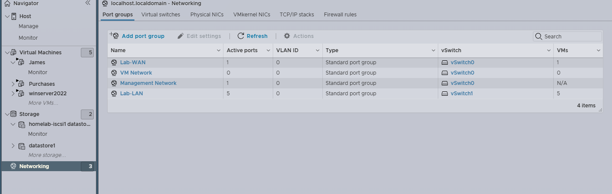
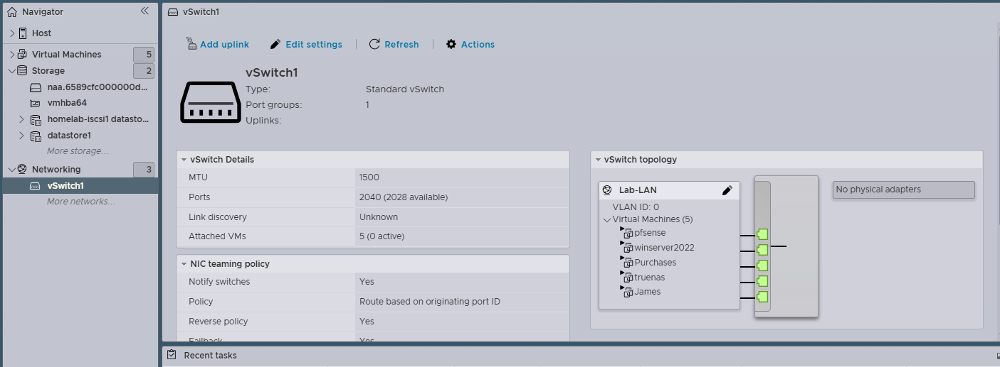
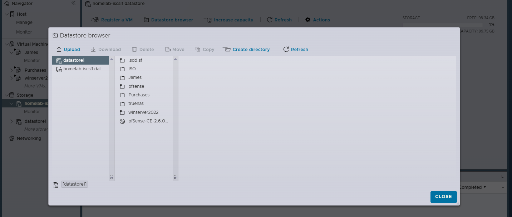
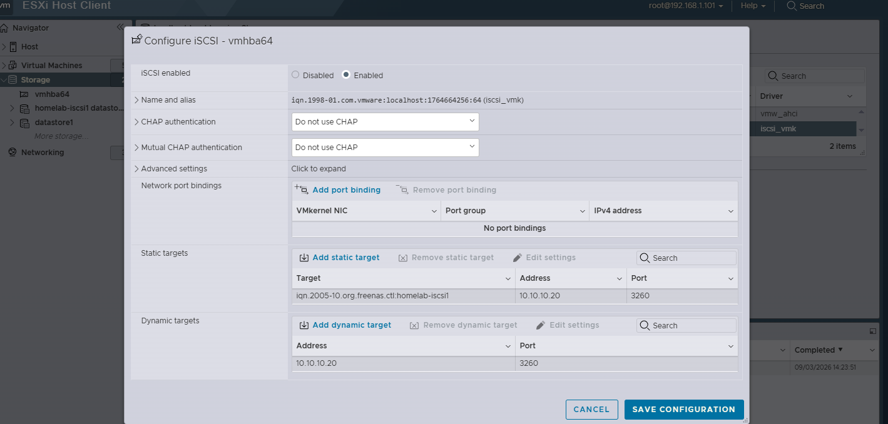
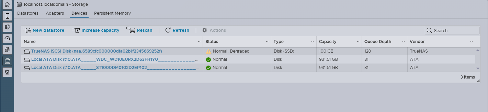

# VMware ESXi Virtualization — Hands-On Homelab

This repository documents the design, deployment, and ongoing administration of a live VMware ESXi hypervisor environment, built and operated independently to develop and demonstrate practical enterprise virtualization skills. It focuses specifically on **ESXi host administration, virtual machine lifecycle management, virtual networking, and storage consumption via iSCSI** — the core competencies of a virtualization/systems administrator responsible for a production-style hypervisor stack.

Companion homelab repositories cover the guest-level and adjacent infrastructure in depth, so this repo stays focused on the hypervisor layer itself:
- **Windows Server 2022 Administration** — directory/file services, GPO, AD *(separate repo)*
- **pfSense Firewall & Routing** — network edge, segmentation, firewall rules *(separate repo)*
- **TrueNAS Storage Administration** — ZFS pools, iSCSI target/share configuration *(separate repo)*

Every skill listed below is backed by direct evidence captured from the live environment — not a guided lab, a course exercise, or a simulation. Screenshots reflect actual host state at the time they were taken.

---

## Table of Contents

1. [Lab Environment](#lab-environment)
2. [Architecture Overview](#architecture-overview)
3. [Skills Matrix](#skills-matrix)
4. [Core Competencies](#core-competencies)
5. [Live Environment Evidence](#live-environment-evidence)
6. [Published Evidence](#published-evidence-direct-links)
7. [Documentation](#documentation)
8. [Repository Structure](#repository-structure)
9. [Roadmap](#roadmap)
10. [Related Repositories](#related-repositories)

---

## Lab Environment

| Component | Detail |
|---|---|
| Hypervisor | VMware ESXi (bare-metal, no vCenter), host `192.168.1.101` |
| Management access | ESXi Host Client (direct, single-host administration) |
| Storage backend consumed | External iSCSI target `10.10.10.20:3260` (TrueNAS-provided) |
| Software iSCSI initiator | `vmhba64` |
| Datastore filesystem | VMFS6 |
| Guest VMs hosted | pfSense (routing/firewall), Windows Server 2022, TrueNAS |
| Virtual networking | vSwitch0 (standard vSwitch), VM Network port group |
| Management style | Standalone host — no vCenter Server, no cluster, no DRS/HA (see Roadmap) |

### Architecture Overview
                    ┌─────────────────────────────┐
                    │   VMware ESXi Host           │
                    │   192.168.1.101              │
                    │                              │
                    │  ┌────────┐ ┌─────────────┐  │
                    │  │pfSense │ │Windows Srv  │  │
                    │  │(edge)  │ │2022         │  │
                    │  └───┬────┘ └──────┬──────┘  │
                    │      │             │         │
                    │  ┌───▼─────────────▼──────┐  │
                    │  │      vSwitch0           │  │
                    │  │   VM Network port group  │  │
                    │  └────────────┬────────────┘  │
                    │               │               │
                    │  ┌────────────▼────────────┐  │
                    │  │  Software iSCSI Initiator│  │
                    │  │        vmhba64            │  │
                    │  └────────────┬────────────┘  │
                    └───────────────┼───────────────┘
                                    │  iSCSI (10.10.10.20:3260)
                            ┌───────▼────────┐
                            │  TrueNAS VM     │
                            │  (SAN backend)  │
                            │  VMFS6 datastore│
                            └─────────────────┘
  
This mirrors a real enterprise pattern: **compute (ESXi)**, **storage (iSCSI SAN)**, and **network edge (firewall/router)** as distinct, integrated tiers rather than one collapsed all-in-one VM — even though all tiers are currently co-located on a single physical host for lab purposes.

---

## Skills Matrix

| Domain | Skill | Enterprise Relevance |
|---|---|---|
| Host Administration | Bare-metal ESXi install & config (no vCenter) | Standalone/branch-office and small-environment deployments |
| Host Administration | ESXi Host Client navigation | Direct host troubleshooting when vCenter is unavailable |
| Host Administration | Resource utilization interpretation (CPU/RAM/storage) | Capacity planning, performance triage |
| VM Lifecycle | VM provisioning (vCPU, memory, disk, guest OS) | Standing up new workloads on demand |
| VM Lifecycle | Multi-role inventory organization | Operating a shared host safely across teams/functions |
| VM Lifecycle | Boot order & startup dependency management | Preventing cascading failures on host reboot |
| Networking | Standard vSwitch design | Traffic segmentation without physical switch changes |
| Networking | Port group creation & assignment | Enforcing which VMs can talk on which segments |
| Networking | Physical-to-virtual networking translation (VLAN/trunk concepts) | Bridging network engineering and virtualization teams |
| Storage | Software iSCSI initiator configuration (`vmhba64`) | Connecting ESXi to any iSCSI SAN in production |
| Storage | Dynamic target discovery | Standard method for onboarding new SAN storage |
| Storage | LUN visibility troubleshooting | Common real-world SAN integration blocker |
| Storage | VMFS6 datastore formatting & provisioning | Turning raw block storage into usable VM storage |
| Storage | Non-disruptive datastore expansion | Growing capacity without downtime |
| Monitoring | Performance baselining | Distinguishing "normal" from "a problem forming" |
| Monitoring | Proactive capacity planning | Avoiding outages caused by resource exhaustion |
| Documentation | Infrastructure-as-documentation practices | Repeatability, handoff, and audit readiness |

---

## Core Competencies

### 1. Hypervisor & Host Administration

**What was done:**
- Installed and configured a bare-metal ESXi host completely independently of vCenter Server — including initial management network configuration, host naming, and access setup
- Operated all day-to-day administration through the ESXi Host Client, without the abstraction layer a vCenter-managed environment provides
- Interpreted host-level resource allocation and utilization across CPU, memory, and storage subsystems to understand what the host is actually doing at any given time
- Read host performance trends over time to catch resource contention before it affects running workloads, rather than discovering problems reactively
- Built a working understanding of the architectural and administrative differences between a standalone ESXi host and a vCenter-managed cluster — what capabilities are lost (centralized management, DRS, HA) and what remains fully functional at the single-host level

**Why it matters:** Many real-world environments — branch offices, small businesses, edge sites, or cost-constrained labs — run standalone ESXi without vCenter. Being comfortable operating directly against the Host Client, without relying on vCenter's conveniences, is a distinct and valuable skill from cluster administration.

**Evidence:** [Host Summary](evidence/01-host-summary.png) · [Performance Monitoring](evidence/02-performance-monitoring.png)

---

### 2. Virtual Machine Lifecycle Management

**What was done:**
- Provisioned VMs from a bare host: allocating vCPU count, memory, and virtual disk sizing appropriate to each guest's role, then selecting the correct guest OS profile for optimal compatibility
- Organized a multi-role VM inventory — a routing/firewall appliance, a Windows Server domain-style workload, and a storage appliance — all coexisting on one host while remaining logically separated by function
- Structured the inventory so unrelated workloads (network edge, directory/file services, SAN) stay conceptually and operationally distinct even when physically co-located
- Managed guest OS boot order and startup dependency awareness — for example, ensuring the storage VM and network VM are online and healthy before workloads that depend on them are started, to avoid failed mounts or lost connectivity on a cold boot

**Why it matters:** Provisioning a VM is the easy part; managing a small fleet of interdependent VMs so the host comes back up cleanly after a reboot — without manual intervention or guesswork — is closer to how real infrastructure has to behave.

**Evidence:** [VM Inventory](evidence/03-vm-inventory.png)

---

### 3. Virtual Networking & Segmentation

**What was done:**
- Designed and configured a standard virtual switch (vSwitch0) to carry both VM traffic and host management traffic
- Created and assigned port groups to explicitly control which VMs can communicate on which network segments, rather than leaving all VMs on a single flat, unmanaged network
- Planned uplink assignment and traffic isolation so that a compromised or misbehaving VM has a bounded blast radius instead of unrestricted visibility into the rest of the environment
- Translated physical networking concepts — VLANs, trunk ports, broadcast domain isolation — into their virtual-switch equivalents, building fluency in how virtual and physical networking layers map onto each other
- Deliberately placed the network-edge VM (pfSense) and other guests on segments consistent with their role, rather than defaulting everything to the same port group

**Why it matters:** Virtual networking mistakes are a common source of real production incidents — flat networks, missing isolation, or misassigned port groups. Understanding vSwitch design at this level demonstrates the same isolation-first thinking used in enterprise network segmentation.

**Evidence:** [Port Groups](evidence/04-port-groups.png) · [vSwitch0 Topology](evidence/05-vswitch0-topology.png)

---

### 4. Storage Consumption & iSCSI Integration (Hypervisor Side)

**What was done:**
- Configured a software iSCSI initiator (`vmhba64`) on the ESXi host starting from a completely bare configuration — no pre-existing storage adapter setup
- Set up dynamic target discovery against an external iSCSI SAN (`10.10.10.20:3260`) rather than relying on local host disk, mirroring how production hosts consume shared storage
- Diagnosed and resolved LUN visibility issues between the iSCSI initiator and the target — a genuinely common real-world failure point in SAN integration (network path issues, target configuration mismatches, initiator IQN problems) rather than a scripted, guaranteed-to-work lab step
- Formatted the discovered LUN as a VMFS6 datastore and provisioned it for VM use
- Planned and executed datastore capacity expansion without disrupting any running VMs — a task that requires understanding how VMFS handles live extent growth

**Why it matters:** This is the piece that separates "I can click through a wizard" from "I understand the storage stack." Troubleshooting LUN visibility specifically — rather than having it just work — is where the practical skill actually shows up, and it's one of the most frequently cited real-world SAN pain points.

**Evidence:** [Datastores](evidence/06-datastores.png) · [Discovered LUN](evidence/07-discovered-lun.png) · [iSCSI Disk Visibility](evidence/08-truenas-iscsi-disk.png)

---

### 5. Infrastructure Monitoring & Capacity Planning

**What was done:**
- Used host-level performance charts to establish a baseline for what "normal" CPU, memory, and storage utilization looks like for this environment
- Learned to recognize early indicators of resource pressure — storage nearing capacity, sustained CPU load — before they escalate into outages
- Made capacity decisions, such as the datastore expansion above, based on observed utilization trends rather than reacting only after a resource is exhausted

**Why it matters:** Monitoring without action is just data collection. Tying observed trends directly to a capacity decision (expanding the datastore) demonstrates the full loop — baseline, detect, act — rather than isolated dashboard-watching.

**Evidence:** [Performance Monitoring](evidence/02-performance-monitoring.png) · [Datastores](evidence/06-datastores.png)

---

### 6. Systems Thinking & Documentation

**What was done:**
- Designed a hypervisor-centric topology that reflects real enterprise patterns — compute, storage, and network edge treated as separate, integrated tiers rather than collapsing everything into a single VM or flat network
- Documented host configuration, storage state, and networking decisions as they were made, for repeatability and future troubleshooting
- Structured this repository's evidence and write-ups so technical decisions are traceable after the fact — a reviewer can see not just what was configured, but why

**Why it matters:** Infrastructure that isn't documented is infrastructure that can't be handed off, audited, or safely modified by anyone else — including a future version of the person who built it.

**Evidence:** [Full documentation](docs/esxi-homelab-documentation.pdf)

---

## Live Environment Evidence

### Host Administration

Host-level view of `192.168.1.101` — CPU, memory, and storage overview from the ESXi Host Client.

Monitor tab showing real-time CPU, memory, and storage performance charts for the host.

### Virtual Machine Management

Inventory list showing pfSense, Windows Server 2022, and TrueNAS VMs organized on a single host.

### Virtual Networking

Port group configuration for VM Network.

vSwitch0 topology showing uplinks and port group assignment.

### Storage & iSCSI Integration

Datastore list showing the iSCSI-backed VMFS6 datastore and available capacity.

Storage Adapters view — software iSCSI adapter (`vmhba64`) with the dynamic target configured and the LUN discovered.

Storage Devices view confirming the iSCSI disk is visible to the host end-to-end — from initiator configuration to usable block storage.

---

## Published Evidence (Direct Links)

1. [Host Summary](evidence/01-host-summary.png)
2. [Performance Monitoring](evidence/02-performance-monitoring.png)
3. [VM Inventory](evidence/03-vm-inventory.png)
4. [Port Groups](evidence/04-port-groups.png)
5. [vSwitch0 Topology](evidence/05-vswitch0-topology.png)
6. [Datastores](evidence/06-datastores.png)
7. [Discovered LUN](evidence/07-discovered-lun.png)
8. [iSCSI Disk Visibility](evidence/08-truenas-iscsi-disk.png)

---

## Documentation

Full ESXi build notes, storage configuration steps, and network diagram: [`docs/esxi-homelab-documentation.pdf`](docs/esxi-homelab-documentation.pdf)

---

## Repository Structure

---

## Roadmap

- [ ] VM snapshot manager screenshot and writeup (VM-level snapshot workflow, use cases, and limitations)
- [ ] Resource pool / reservation and limit configuration writeup
- [ ] vMotion / HA / DRS configuration writeup (requires multi-host expansion + vCenter)
- [ ] Host hardening and lockdown mode configuration
- [ ] Network topology diagram (hypervisor layer, exported/drawn separately from the ASCII overview above)
- [ ] Backup/replication strategy for VMs on this host

---

## Related Repositories

- **Windows Server Administration** — guest-level AD/GPO/file services *(link here once published)*
- **pfSense Firewall & Routing** — network edge and segmentation *(link here once published)*
- **TrueNAS Storage Administration** — ZFS pools and iSCSI target configuration *(link here once published)*

---

**Author:** James Kyanika
**Role:** Network & Systems Administrator
**LinkedIn:** https://www.linkedin.com/in/jameskyanika
